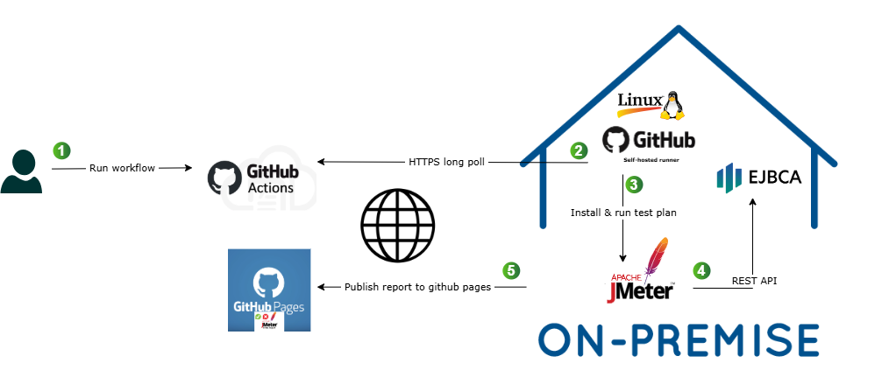
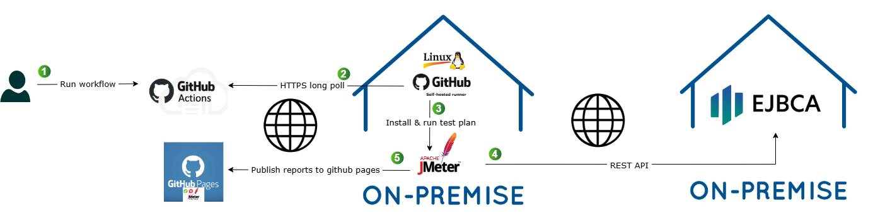
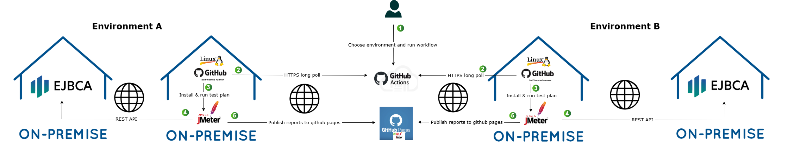

# EJBCA performance tests


This project implements performance tests on EJBCA instances using GitHub workflows.  
<p align="justify">
The workflow runs on any self-hosted Linux runner added to the repo.  
It will install JMeter on the runner's file system and run the JMeter test defined on tests/ejbca-performance-test.jmx.  
This test creates a key with the chosen algorithm and a CSR based on that key. Through EJBCA API /ejbca/ejbca-rest-api/v1/certificate/pkcs10enroll the pretended certificate is created.  
</p>

<br><br>
| **Figure 1: GitHub runner and EJBCA on the same server.** |
|:--:|
|  |


<br><br>
| **Figure 2: GitHub runner and EJBCA on different servers** |
|:--:|
|  |


<br><br>
| **Figure 3: Choose in which EJBCA will run the workflow** |
|:--:|
|  |


<br><br>

## Pre-requisites

 - The self-hosted runner must have installed jq tool
```
sudo apt-get install jq
```
 - `/ejbca/ejbca-rest-api/v1/certificate` endpoint must be enable on EJBCA  

 - A new branch with name "gh-pages" must be created to store reports


## Get Started

1. Go to repository settings and choose Actions | Runners.  
Create a new self-hosted runner on your premises.  
Add a new label (example: prod) to that runner.  

2. Go to Environments and create a new environment with exactly the same name as the label added to the runner in the previous step.
   - Add one environment secret with the name "EJBCA_KEYSTORE_PASS". This secret must be configured with the EJBCA keystore password.
   - Add 3 environment variables
     - EJBCA_HOSTNAME: with the hostname of the server where EJBCA is installed (example: localhost)
     - EJBCA_P12_KEYSTORE_FILE: path to the p12 keystore file (example: /opt/ejbca-ce/p12/superadmin.p12)
     - EJBCA_PORT: EJBCA HTTPS API port (example: 8443)

3. Go to Actions and in the "Actions" list choose "Performance test", and then "Run workflow"

4. This workflow is parameterized, and mandatory settings must be filled:
   - Environment: choose the environment (previously configured) where you want to run this test
   - Number of threads: fill with the number of (parallel) users pretended in this run
   - Number of certificates per thread: fill with the number of certificates each user must request
   - Key algorithm: choose the key algorithm to this run
   - CA name: fill with the name of CA to issue the certificates  
   Example:  
    new_rsa2048_issuing_rsa2048  
    new_eddsa_issuing_ed25519  
    new_ecc_issuing_secp384r1  
   - CA profile name: fill with CA profile name  
   Example:  
    new_ENDUSER  
   - End user profile name: fill with end-user profile name  
    new_ENDUSER  
   - Subject DN: fill with subject DN. This can be dynamically customized for each user with the character "#".   
   Example: If subject DN =  "/CN=enduser#/O=enduser#_org/C=PT"   
    For user 1: /CN=enduser2/O=enduser1_org/C=PT  
    For user 2: /CN=enduser2/O=enduser2_org/C=PT  
    For user 3: ...  


5. The results can be consulted on the GitHub pages from this repository. Link to GitHub pages available at Settings | Pages

